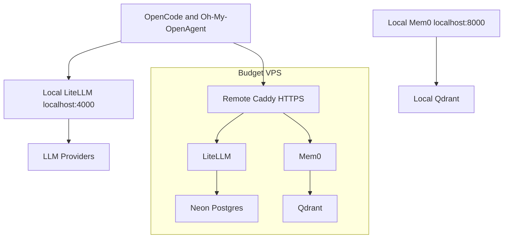

# Hybrid OpenAgent Stack

Budget-friendly infrastructure for an AI coding workflow built around:

- **OpenCode + Oh-My-OpenAgent** for local agent orchestration.
- **LiteLLM** for OpenAI-compatible model routing, spend tracking, and fallbacks.
- **Mem0** for agent memory.
- **Local PostgreSQL + pgvector** for development persistence.
- **Neon Postgres** for production LiteLLM persistence.
- **Qdrant** for vector search.
- **Caddy** for production HTTPS reverse proxying.

The intended shape is hybrid: run the fast local stack on your Mac during daily development, and keep a small VPS stack online for remote HTTPS access and durable shared state.

## Architecture



## Files

| Path                                 | Purpose                                                 |
| ------------------------------------ | ------------------------------------------------------- |
| `docker-compose.yml`                 | Shared LiteLLM, Mem0, and Qdrant service graph          |
| `docker-compose.local.yml`           | Local PostgreSQL for LiteLLM and loopback port bindings |
| `docker-compose.prod.yml`            | Production Caddy bindings and LiteLLM Neon settings     |
| `mem0/Dockerfile`                    | amd64-safe Mem0 API image build from Python source path |
| `Caddyfile`                          | HTTPS reverse proxy and status endpoint                 |
| `litellm.config.yaml`                | Cost-first model routing and LiteLLM settings           |
| `oh-my-openagent.jsonc`              | Source Oh-My-OpenAgent agent definitions                |
| `scripts/render-openagent-config.sh` | Generates local or remote OpenAgent configs             |
| `scripts/with-env.sh`                | Loads `.env.local` or `.env.prod` for Makefile helpers  |
| `scripts/health-check.sh`            | Local/prod doctor checks                                |
| `docs/adr/`                          | Architecture decisions                                  |
| `docs/superpowers/specs/`            | Design spec for this stack                              |

## Quick Start

```bash
make install-local
```

This creates `.env.local` from `.env.local.example`.

Fill in `.env.local` with your runtime values. Do not commit it.

Start the local stack:

```bash
make dev
make doctor
make agent-config-local
```

The generated local OpenAgent config is written to:

```text
.generated/oh-my-openagent.local.jsonc
```

## Production VPS

Point these records at the VPS:

- `litellm.pratyushsudhakar.com`
- `mem0.pratyushsudhakar.com`
- `status.pratyushsudhakar.com`

Deploy on the VPS:

```bash
make install-prod
make prod
make doctor-prod
make agent-config-remote
```

`make install-prod` creates `.env.prod` from `.env.prod.example`.

`make prod` now runs Compose with `--build`, so Mem0 is rebuilt from `mem0/Dockerfile` on the VPS instead of depending on `mem0/mem0-api-server:latest`.

Production expects `DATABASE_URL` in `.env.prod` to point at your Neon connection string for LiteLLM. Mem0 stores vectors in Qdrant and its lightweight API history in the `mem0_data` Docker volume, so it does not require Neon-specific Postgres settings.

Public production endpoints:

| Service     | URL                                          |
| ----------- | -------------------------------------------- |
| LiteLLM UI  | `https://litellm.pratyushsudhakar.com/ui`    |
| LiteLLM API | `https://litellm.pratyushsudhakar.com/v1`    |
| Mem0 API    | `https://mem0.pratyushsudhakar.com`          |
| Status      | `https://status.pratyushsudhakar.com/health` |

## Daily Commands

| Command                                    | Description                                          |
| ------------------------------------------ | ---------------------------------------------------- |
| `make install-local` / `make install-prod` | Create `.env.local` or `.env.prod` from the examples |
| `make dev`                                 | Start local stack                                    |
| `make prod`                                | Start/update production VPS stack                    |
| `make doctor`                              | Check local stack health                             |
| `make doctor-prod`                         | Check production stack health                        |
| `make status` / `make status-prod`         | Show service status                                  |
| `make logs` / `make logs-prod`             | Tail logs                                            |
| `make backup` / `make backup-prod`         | Dump local Postgres or Neon to `backups/`            |
| `make restore` / `make restore-prod`       | Restore latest SQL backup locally or to Neon         |
| `make config-check`                        | Validate compose files and scripts                   |
| `make agent-config-local`                  | Render local OpenAgent config                        |
| `make agent-config-remote`                 | Render remote OpenAgent config                       |

## URL Rules

- `localhost` in `.env.local` / `.env.local.example`, `docker-compose.local.yml`, and local docs is for your Mac.
- `127.0.0.1` in `docker-compose.prod.yml` is intentional: LiteLLM and Mem0 bind to VPS loopback so only Caddy is public.
- `localhost` inside Docker health checks is container-local and should not be changed to the public domain.
- Production client-facing values live in `.env.prod` / `.env.prod.example` and use `https://litellm.pratyushsudhakar.com` / `https://mem0.pratyushsudhakar.com`.

## Cost Strategy

The infrastructure budget target is $5-15/month, excluding LLM API usage. The stack intentionally avoids Kubernetes, Redis, and paid observability until the workflow needs them. Since you already have Neon, production uses Neon instead of self-hosting PostgreSQL on the VPS.

Model cost control lives in `litellm.config.yaml`:

- Free or quota-backed models first.
- Cheap paid models before premium models.
- Anthropic direct API models remain last-resort because Claude Pro web subscriptions are not API credits.
- Provider budget guardrails are documented in the LiteLLM config.

## Security Posture

- `.env.local`, `.env.prod`, and generated configs are ignored.
- Production app services bind to loopback or Docker networks.
- Local PostgreSQL is development-only; production PostgreSQL is Neon over TLS.
- Qdrant is not public.
- Public traffic enters through Caddy on ports 80/443.
- The custom LiteLLM Dockerfile was removed; production uses the official image and runtime-mounted config.
- Mem0 is built from `python:3.12-slim` plus pinned Python dependencies to avoid upstream image manifest gaps on `linux/amd64`.

## Verification

Run static checks:

```bash
make config-check
```

Run live local checks after starting services:

```bash
make doctor
```

Run live production checks on the VPS:

```bash
make doctor-prod
```

## Client Setup

Install OpenCode and Oh-My-OpenAgent on your local machine:

```bash
curl -fsSL https://opencode.ai/install | bash
bunx oh-my-opencode install --no-tui --claude=yes --gemini=yes --openai=yes
bunx oh-my-opencode doctor
```

Use `scripts/render-openagent-config.sh` or the Makefile targets to generate a local or remote OpenAgent config from `oh-my-openagent.jsonc`. The Makefile targets read the matching `.env.local` or `.env.prod` file so the rendered config uses the configured LiteLLM base URL and key.

## License

MIT — Pratyush Sudhakar
